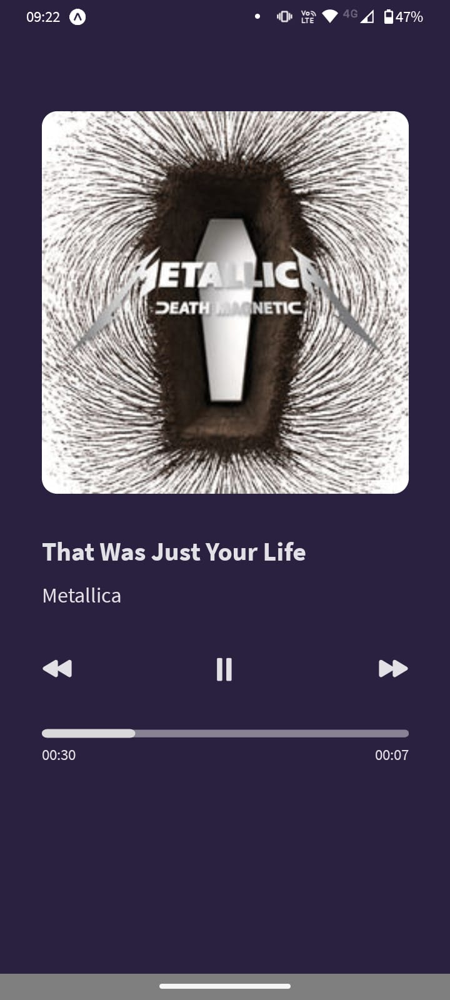
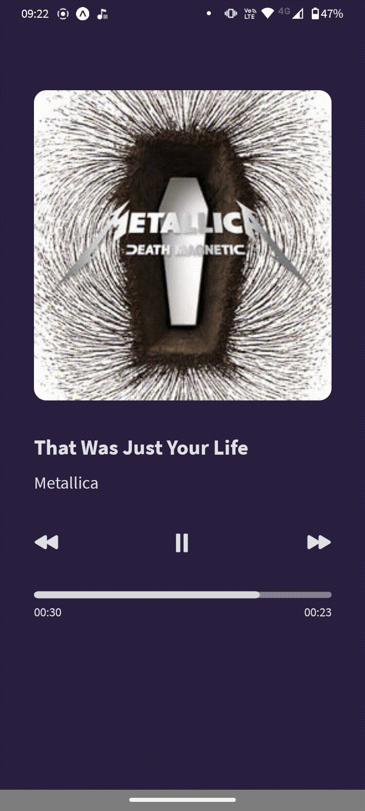

# Player de música

### **Descrição**
Reprodutor de música feito em React Native seguindo o layout do desafio da rocketseat #boraCodar.

Imagem do layout do projeto

### **Recursos utilizados**
- Typescript
- React native com Expo
- Expo AV
- Rapid API
- Axios
- React Native SVG

### **App e implementação**

  
   

Para a reprodução das músicas foi utilizado o pacote Expo AV e para o carregamento das músicas foi utilizado a Rapid API que pode ser acessado neste link <https://rapidapi.com/hub>. 
Nela são disponibilizadas várias previews de músicas para utilização. Então foi selecionado um album e listada as previews de cada uma dentro do App. 
A barra de carregamento foi criada com a lib react-native-svg.

### **Melhorias**
Por hora são essas funcionalidades, mas pretendo ir implementando e colocar o click na barra de carregamento para alterar a parte da música em execução, entre outras coisas.